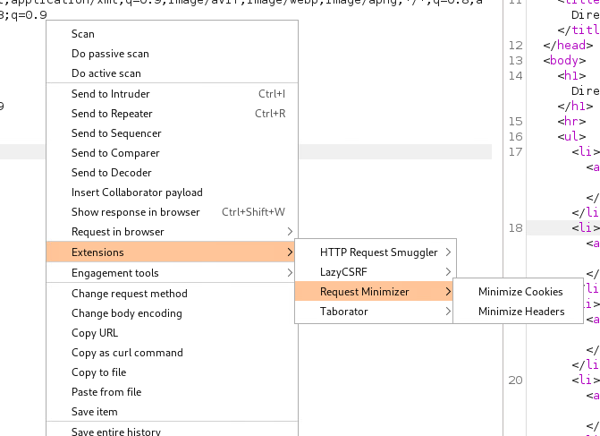

# Burp Suite Request Minimizer Extension

This extension minimizes headers or cookies for current HTTP request in the invoked context. It will display the Request with the smallest number of headers/cookies without any change in the Response  

## Installation

Download the JAR from [Releases](https://github.com/r3l1v/RequestMinimizer/releases/). In Burp Suite, go to the Extensions tab in the Extender tab, and add a new extension. Select the extension type Java, and specify the location of the JAR.

Building the extension is possible with gradle. All necessary files are included in the [Java](https://github.com/r3l1v/RequestMinimizer/tree/main/Java) directory.

## Usage

Upon adding the extension into Burp Suite, Request Minimizer can be invoked by right clicking on request that we want to minimize and selecting it from the context menu. `Extensions`->`Request Minimizer`

Two options will be available, `Minimize Headers` and `Minimize Cookies`. 

The request on which has the context menu been invoked will be passed into the corresponding requestMinimizer classes and after the minimalization process will be done, new UI window with option to copy this request will appear.

## To do 

- minimalization of parameters
- minimalization of request body (xml/json)